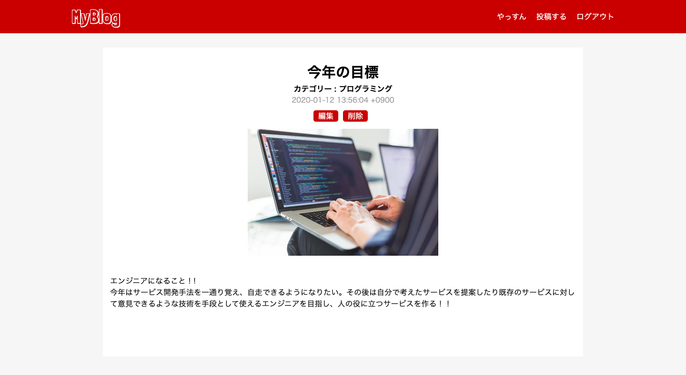
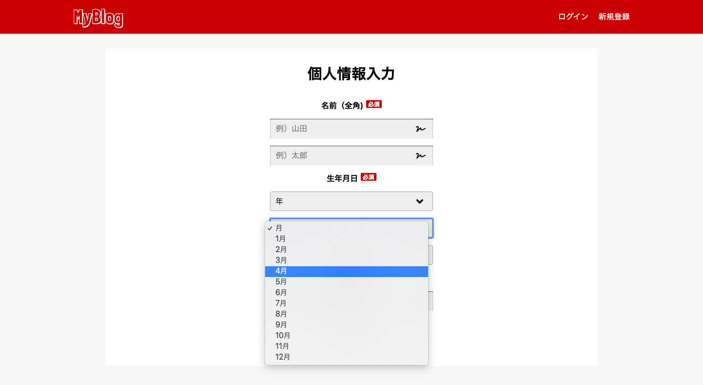
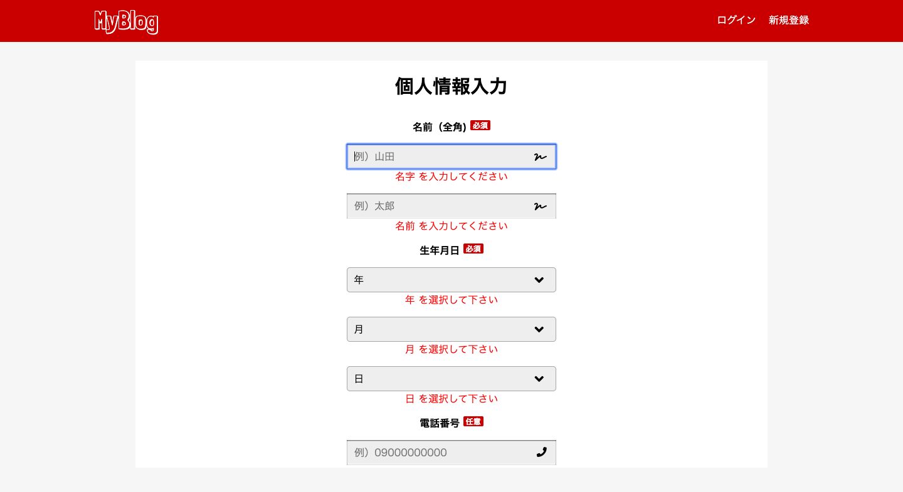

# MyBlog

## 🖥必要条件
- ruby 2.5.1
- rails 5.2.4.1
- haml 5.1.2
- sass 3.7.4
- Rspec 3.9
- capistrano 3.11.2
- AWS
  - EC2

## 📖説明
ブログアプリです。生活、暮らし、仕事、趣味など様々なカテゴリを選んで写真と一緒に投稿できます。

## 🚀使い方
１、トップページからログインまたは新規登録。 
２、登録できたら新規投稿ボタンから投稿しましょう。

## 👏工夫した点
### 静的データの扱い
- まず新規登録ページは２ページで構成しました。sessionを用いてcokkieに値を保存しながら２ページ目の登録ボタンでデータベースに保存されます。新規登録ページでは生年月日入力部分をcollection_selectを用いて選択式にしたのですが、生年月日は静的データであるためactivehashというgemやenumを使い、個別にモデルを作成しそこからデータを引っ張ってきました。これにより最低限のテーブルでアプリを作ることができました。

### バリデーション
- 新規登録画面,新規投稿画面の必須項目の部分は全てバリデーションがかかっているので未入力で確定するとエラーメッセージが表示されます。

## ✨単体テスト/統合テスト(RSpec)

　

## usersテーブル
|Column|Type|Options|
|------|----|-------|
|email|string|null: false|uniqueness: true|
|password|string|null: false|uniqueness: true|
|nickname|string|null: false|
|first_name|string|null: false|
|last_name|string|null: false|
|year_id|integer|null: false|
|month_id|integer|null: false|
|date_id|integer|null: false|
|phone_number|string|null: false|uniqueness: true|
|icon|string|

### Association
- has_many :posts
- belongs_to_active_hash :year
-  belongs_to_active_hash :month

## postsテーブル
|Column|Type|Options|
|------|----|-------|
|user_id|references|null: false,foreign_key: true|
|category|integer|null: false|
|title|string|null: false|
|image|text|null: false|
|content|text|null: false|

### Associtaion
- belongs_to :user

### yearモデル
### monthモデル
- 静的なデータのためアクティブハッシュを使用しました。
